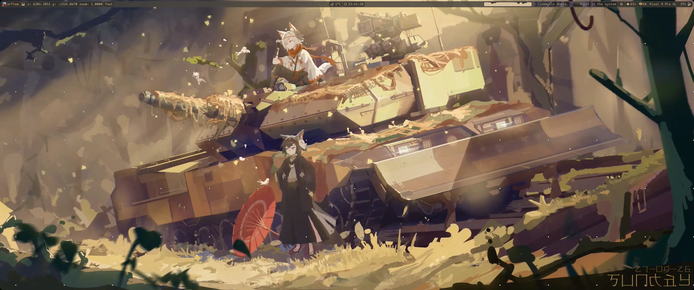
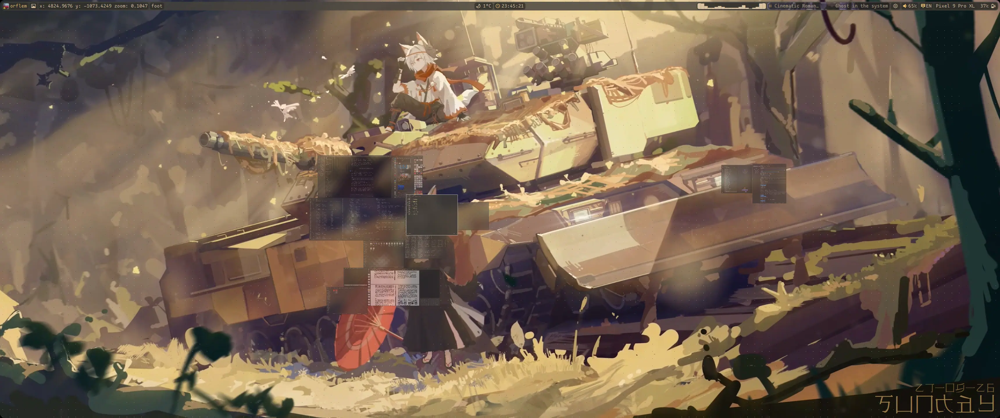
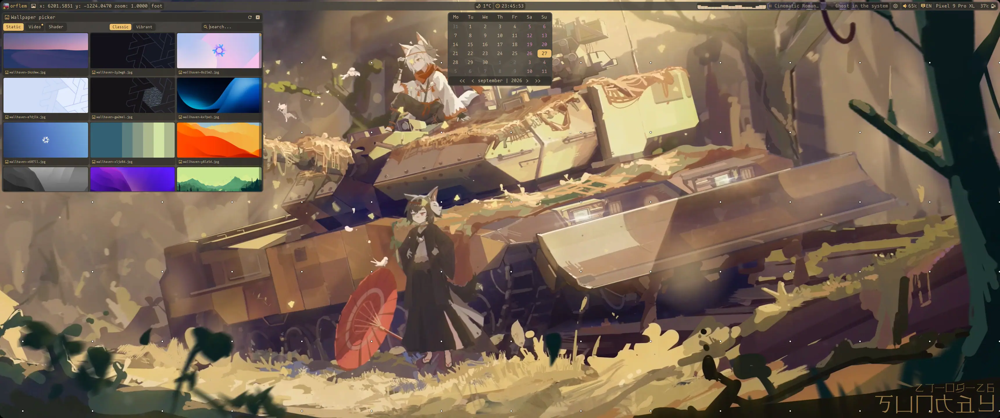
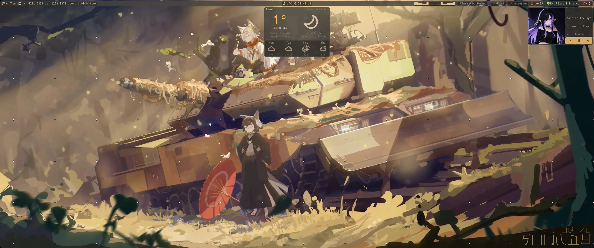
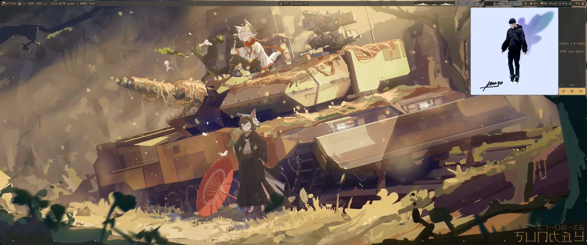
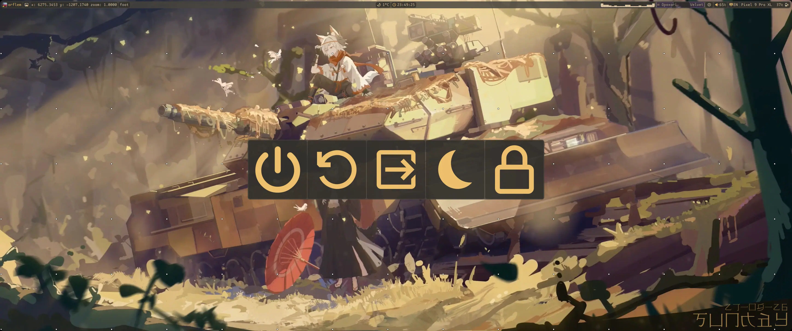
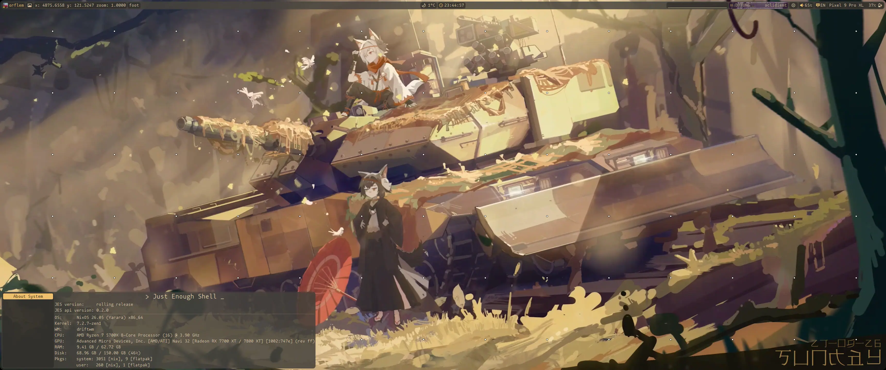
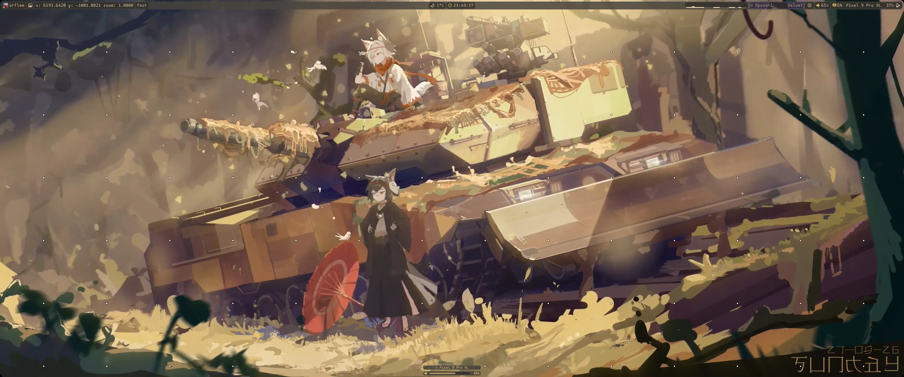
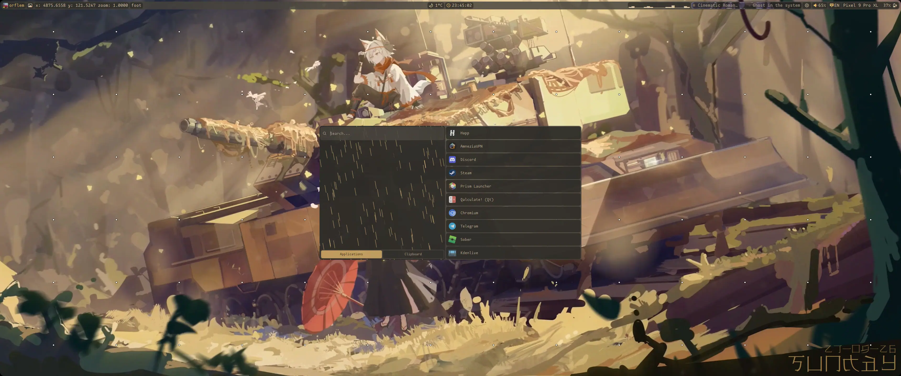
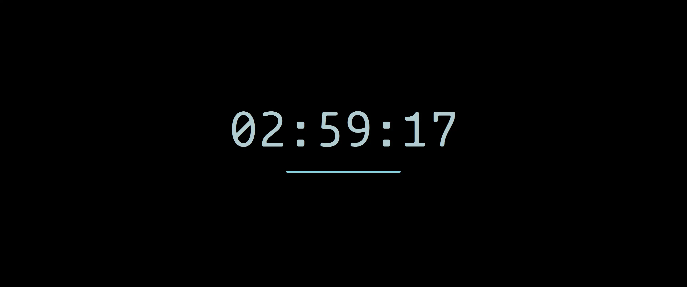

# _ORFLEM_\'s dotfiles

## based on NixOS, primary WM - driftwm

> !WARNING!
>
> This dotfiles don't good for ctrl c - ctrl v because it's snapshot for \_ORFLEM\_\'s PC
> In this dotfiles you should look on NixOS configurations - it's very big config, it's eat a lot of ssd. You should modify this config!
> Dotfiles hardcored on author monitor, in wm configs you need change output params

### Images:
#### Panels

#### wallpaper picker

#### player

#### power menu

#### Jwindow

#### osd

#### launcher

#### lockscreen

